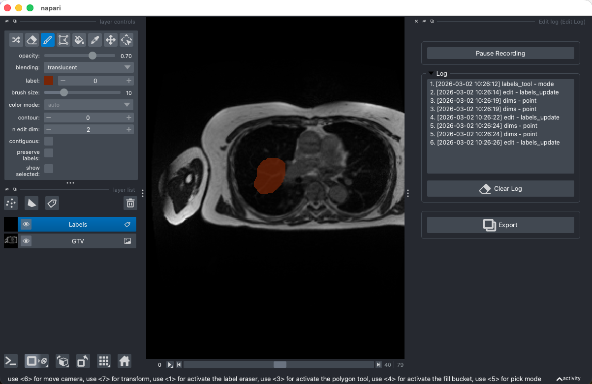

# napari-edit-log

A napari plugin to record how a user interacts with napari, e.g. which layers are added, removed, or edited. The plugin provides a log view to inspect the recorded interactions and a way to export the log for further analysis.

