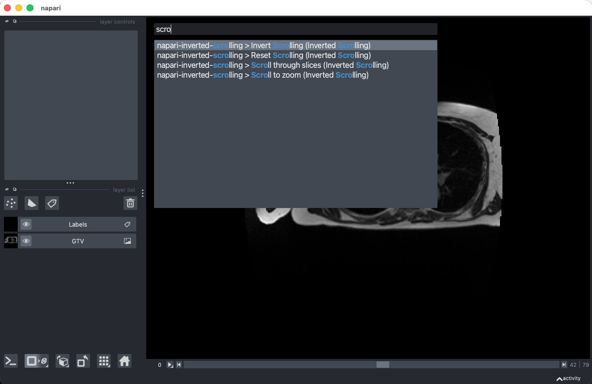

# napari-inverted-scrolling

A napari plugin to invert the scrolling behavior of the mouse wheel. When enabled, scrolling will move through slices instead of zooming, without needing to hold the Control key. This behaviour is inverted to the default napari behavior, which is to zoom when scrolling and move through slices when holding the Control key.

The behavior can be inverted using the `Invert Scrolling` and `Reset Scrolling` commands in the napari command palette (`Ctrl+Shift+P`). The `Scroll through slices` and `Scroll to zoom` commands are added as alternative names.

