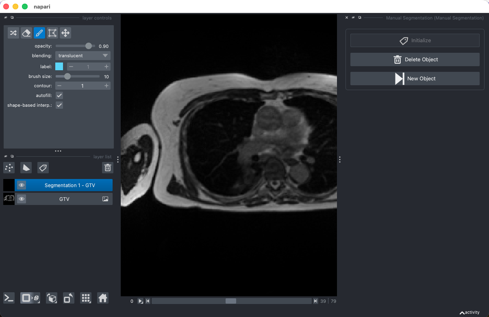

# napari-manual-segmentation

A napari plugin to streamline manual segmentation tasks by providing opinionated labels layer and a helper UI for switching between objects, inspiered by [nnInteractive](https://github.com/MIC-DKFZ/napari-nninteractive).

