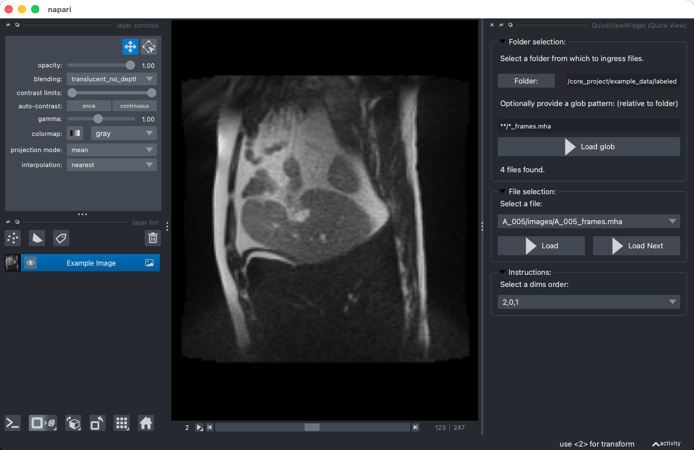

# napari-quick-view

This plugin for [napari](https://napari.org/) provides a ui to quickly cycle through different images in a napari viewer.

## Usage

Once installed, the plugin can be accessed from the napari plugins menu: `Plugins -> Quick View`.

After opening the plugin, select a folder to load images from. Additionally you can provide a file/glob pattern to filter the images in the folder (for example `**/*.mha` to only load mha images from nested folders).

After clicking the "Load" button, the number of matching files is shown and a new section appears. Here all matching files are listed in a dropdown. You can select an image from the dropdown and click the "Show" button to display it in the viewer. The image will be added as a new layer. Alternatively, you can use the "Next" button to cycle through the images.

How images are loaded can be controlled via the settings below.

## Notes & Limitations

- The plugin is still under development, and some features may not work as expected. Most notably, only all files are loaded via SimpleITK, which may not support all image formats.
- Only transposing is currently supported as a pre-processing step.
- This plugin is designed to be embedded in other applications, where browsing through images is needed.