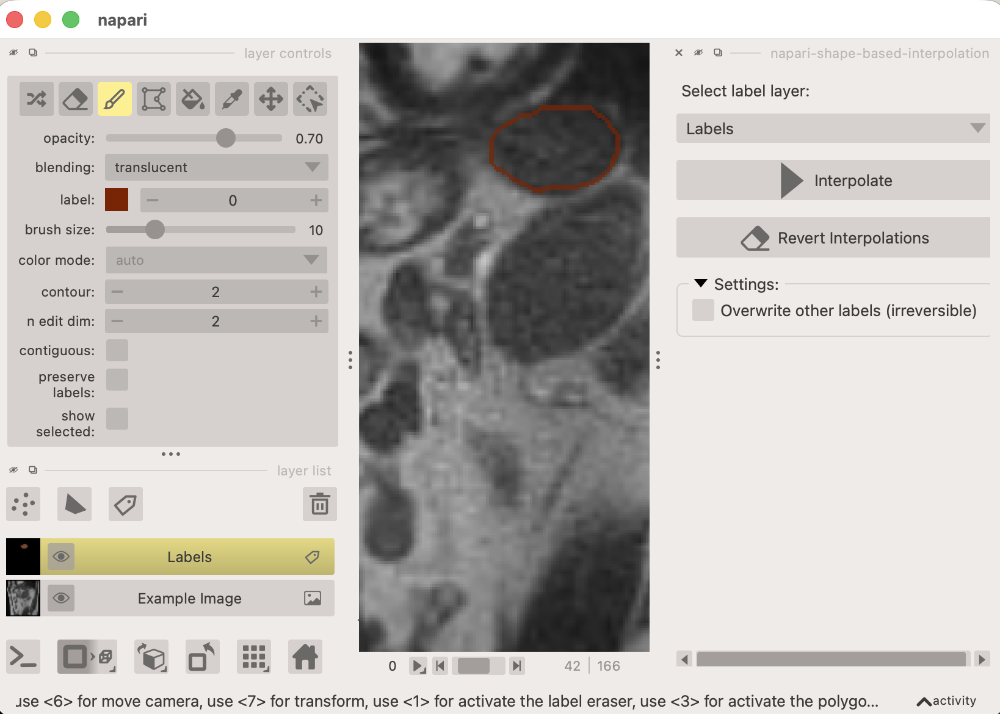

# napari-shape-based-interpolation

This plugin for [napari](https://napari.org/) provides shape-based interpolation of labels between keyframes. This can be used as an alternative to AI-based methods for label interpolation.

## Usage

Once installed, the plugin can be accessed from the napari plugins menu: `Plugins -> Shape Based Interpolation`.

After opening the plugin, select a labels layer from the dropdown. 
To perform shape-based interpolation, first create labels on a few keyframes (manually). Then, click the "Interpolate" button to fill in the labels on the frames in between the keyframes. The interpolated labels will be added to the selected labels layer.

## Notes & Limitations

- The plugin currently only supports interpolation along the first axis (usually time or z-axis) and with 2D shapes (i.e. 2D+t or 3D volumes with orthogonal slicing).
- The interpolation is based on simple shape morphing and may not produce accurate results for complex shapes.
- Interpolation is performed only for the selected label id in the controls of the selected labels layer.
- By default interpolation may not overwrite existing labels. This behaviour can be changed in the settings.
- Interploation is performed on a best effort basis. If the shapes change too much between keyframes, the interpolation may produce empty or otherwise unexpected results.
- The interpolation can be reverted using the clear button, which removes all labels that were added by the interpolation.
- When editing the labels after interpolation, the list of keyframes is updated automatically, so that re-interpolating will keep the manually edited frames intact. These frames will **not** be overwritten during re-interpolation or clearing.