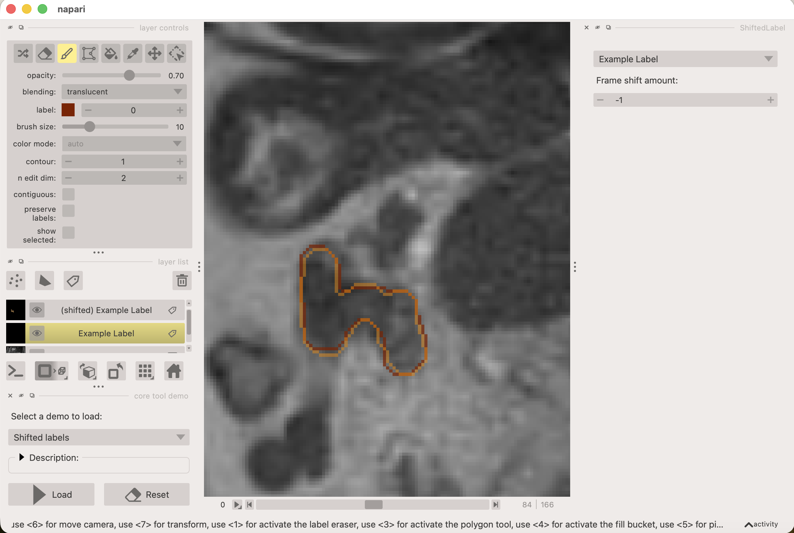

# napari-shifted-labels

This plugin for [napari](https://napari.org/) visualizes labels across frames to provide a more consistent segmentation experience when working with time-lapse or z-stack data.

The idea is that when segmenting objects that move slowly across frames, it is helpful to see the labels from previous/future frames as a reference, to maintain consistent labeling of objects over time.

See this example, where the red contour is the actual label and the orange contour is the shifted label from the previous frame:

## Usage

Once installed, the plugin can be accessed from the napari plugins menu: `Plugins -> Shifted Labels`.

After opening the plugin, select a labels layer from the dropdown. The plugin will then add a shifted version of the selected labels layer to the labels list. You can use the slider to adjust how many frames to shift the labels. The appearance of the shifted labels can be customized in the layer controls of the  (e.g. cycle the colors and adjust contour width).

To disable the shifted labels, simply remove the shifted labels layer from the labels list or close the plugin widget.

## Notes & Limitations

- The plugin currently only supports shifting along the first axis (usually time or z-axis).
- The shifted labels layer is read-only and cannot be edited directly.
- To show multiple shifted layers (e.g. both past and future frames), you can open multiple instances of the plugin.

