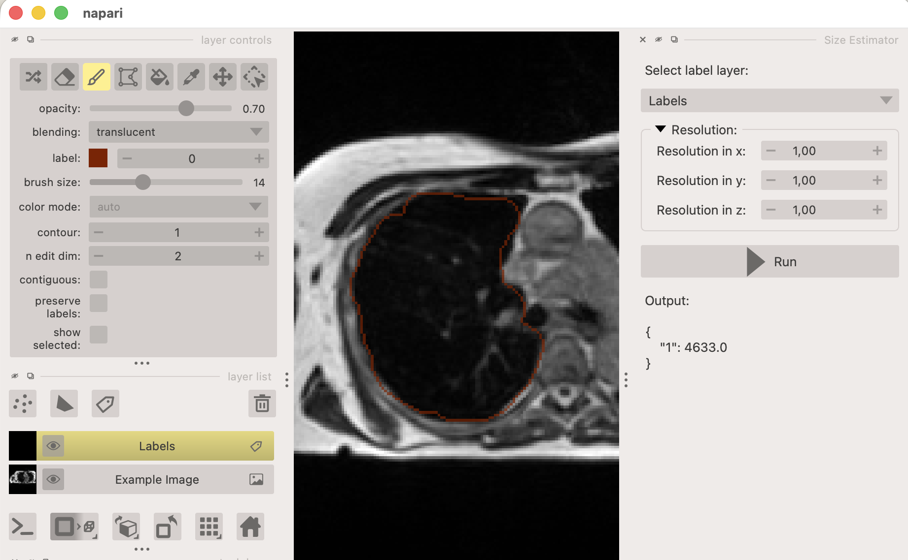

# napari-size-estimator

This plugin for [napari](https://napari.org/) provides functionality to quickly compute the dimensions and volume of labels.

## Usage

Once installed, the plugin can be accessed from the napari plugins menu: `Plugins -> Size Estimator`. 

After opening the plugin, select a labels layer from the dropdown. Next, provide the spacing/voxel size of the image. 
Finally, when clicking the "Run" button, the volume of each label in the selected label layer is computed and shown below. Alternatively, you can enable the "Autorun" option to automatically compute the sizes whenever the label layer or spacing values are changed.

## Notes & Limitations

- This plugin is still under development, and some features may not work as expected. Most notably, only the volume is computed at the moment. 
- Tipp: You can control the spacing via an API, for example when loading an image from a file which contains this metadata (e.g. `.mha` files).